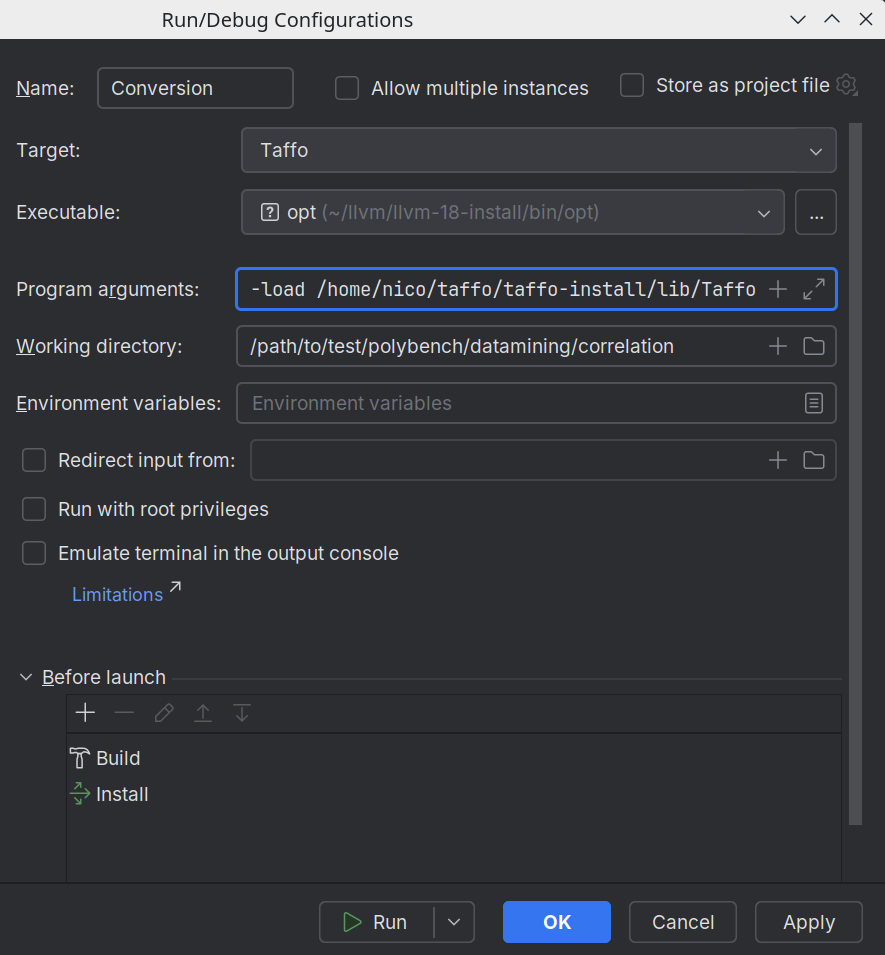

TAFFO *(Tuning Assistant for Floating Point to Fixed Point Optimization)* is a precision-tuning framework to replace floating point operations with fixed point operations.

It is based on LLVM and has been tested on Linux (any attempt to compile on Windows, WSL or macOS is at your own risk and peril).

## How to use TAFFO

Taffo currently ships as 5 LLVM plugins, each one of them containing one LLVM optimization or analysis pass:
 - TaffoTypeDeducer (Small wrapper of the TDA pass https://github.com/NiccoloN/TypeDeductionAnalysis)
 - TaffoInitializer (Initialization pass)
 - TaffoVRA (Value Range Analysis pass)
 - TaffoDTA (Data Type Allocation pass)
 - TaffoConversion (Conversion pass)

To execute TAFFO, a simple frontend is provided named `taffo`, which can be substituted to `clang` in order to compile or link executables.
Behind the scenes, it uses the LLVM `opt` tool to load one pass at a time and run it on LLVM IR source files.

### 1: Build and install TAFFO

Create a build directory, compile and install TAFFO.
You can either install TAFFO to the standard location of `/usr/local`, or you can install it to any other location of your choice.
In the latter case you will have to add that location to your PATH.

If you have multiple LLVM versions installed, and you want to link TAFFO to a specific one, set the `LLVM_DIR` environment variable to the install-prefix of the correct LLVM version beforehand.

At the moment TAFFO supports LLVM 18 in the master branch and LLVM 14/15 in the llvm-15 branch. No other version is currently supported.
Moreover, LLVM plugins compiled for a given major version of LLVM cannot be loaded by any other version. Therefore, it is not a good idea to redistribute TAFFO as a binary.
If you are building LLVM from sources, you must configure it with `-DLLVM_BUILD_LLVM_DYLIB=ON` and `-DLLVM_LINK_LLVM_DYLIB=ON` for the TAFFO build to succeed.

The following are the minimal commands required for compiling TAFFO on a typical Linux distribution.

```shell
cd /path/to/the/location/of/TAFFO
export LLVM_DIR=/usr/lib/llvm-18 # optional
mkdir build
cd build
cmake ..
cmake --build .
cmake --build . --target install
```

If you want to modify TAFFO or see the debug logs you need to also build LLVM in debug mode first.
You are encouraged to follow our guide: [Building LLVM](doc/BuildingLLVM.md)

### 2: Modify and test the application

Modify the application to insert annotations on the appropriate variable declarations, then use `taffo` to compile your application.

```shell
<editor> program.c
[...]
taffo -O3 -o program-taffo program.c
```

See the annotation syntax documentation or the examples in `test/0_simple` to get an idea on how to write annotations.
You can also test TAFFO without adding annotations, which will produce the same results as using `clang` as a compiler/linker instead of `taffo`.

Note that there is no `taffo++`; C++ source files are autodetected by the file extension instead.

## How to build and run tests and benchmarks

Optionally, create and activate a python virtual environment in the repository root directory:
```shell
python3 -m venv ./venv
source .venv/bin/activate
```

Install python requirements
```shell
pip install -r requirements.txt
```

Then, access the build directory of TAFFO and run all the tests and benchmarks:
```shell
cd test
ctest
```

To run test suites individually and inspect the results, access the test-suite directory of interest and use the python runner, for example:
```shell
cd test/polybench
./run.py
```
Add the option ```-debug``` to the runner to be able to inspect TAFFO's temporary files and debug log, generated in each benchmark's directory.

You can also run a single test at a time, for example:
```shell
cd test/polybench
./run.py -only correlation
```

## How to debug TAFFO

When invoked with the ```-debug``` option, TAFFO launches ```opt``` once for each of its passes with commands like:
```
/path/to/opt -load /path/to/Taffo.so --load-pass-plugin=/path/to/Taffo.so --passes=no-op-module,typededucer                     --stats --debug-only=tda,taffo-common,taffo-typededucer   -S -o out.ll in.ll
/path/to/opt -load /path/to/Taffo.so --load-pass-plugin=/path/to/Taffo.so --passes=no-op-module,taffoinit                       --stats --debug-only=taffo-common,taffo-init              -S -o out.ll in.ll
/path/to/opt -load /path/to/Taffo.so --load-pass-plugin=/path/to/Taffo.so --passes=no-op-module,function(taffomem2reg),taffovra --stats --debug-only=taffo-common,taffo-mem2reg,taffo-vra -S -o out.ll in.ll
/path/to/opt -load /path/to/Taffo.so --load-pass-plugin=/path/to/Taffo.so --passes=no-op-module,taffodta,globaldce              --stats --debug-only=taffo-common,taffo-dta               -S -o out.ll in.ll
/path/to/opt -load /path/to/Taffo.so --load-pass-plugin=/path/to/Taffo.so --passes=no-op-module,taffoconv,globaldce,dce         --stats --debug-only=taffo-common,taffo-conv              -S -o out.ll in.ll
```

You can find the real commands int the debug log of each test. For example, in my case I get these for the benchmark ```correlation``` inside polybench:
```
/home/nico/llvm/llvm-18-install/bin/opt -load /home/nico/taffo/taffo-install/lib/Taffo.so --load-pass-plugin=/home/nico/taffo/taffo-install/lib/Taffo.so --passes=no-op-module,typededucer                     --stats --debug-only=tda,taffo-common,taffo-typededucer   -temp-dir=./taffo_temp -S -o ./taffo_temp/correlation-taffo.1.taffotmp.ll ./taffo_temp/correlation-taffo.0.taffotmp.ll
/home/nico/llvm/llvm-18-install/bin/opt -load /home/nico/taffo/taffo-install/lib/Taffo.so --load-pass-plugin=/home/nico/taffo/taffo-install/lib/Taffo.so --passes=no-op-module,taffoinit                       --stats --debug-only=taffo-common,taffo-init              -temp-dir=./taffo_temp -S -o ./taffo_temp/correlation-taffo.2.taffotmp.ll ./taffo_temp/correlation-taffo.1.taffotmp.ll
/home/nico/llvm/llvm-18-install/bin/opt -load /home/nico/taffo/taffo-install/lib/Taffo.so --load-pass-plugin=/home/nico/taffo/taffo-install/lib/Taffo.so --passes=no-op-module,function(taffomem2reg),taffovra --stats --debug-only=taffo-common,taffo-mem2reg,taffo-vra -temp-dir=./taffo_temp -S -o ./taffo_temp/correlation-taffo.3.taffotmp.ll ./taffo_temp/correlation-taffo.2.taffotmp.ll
/home/nico/llvm/llvm-18-install/bin/opt -load /home/nico/taffo/taffo-install/lib/Taffo.so --load-pass-plugin=/home/nico/taffo/taffo-install/lib/Taffo.so --passes=no-op-module,taffodta,globaldce              --stats --debug-only=taffo-common,taffo-dta               -temp-dir=./taffo_temp -S -o ./taffo_temp/correlation-taffo.4.taffotmp.ll ./taffo_temp/correlation-taffo.3.taffotmp.ll
/home/nico/llvm/llvm-18-install/bin/opt -load /home/nico/taffo/taffo-install/lib/Taffo.so --load-pass-plugin=/home/nico/taffo/taffo-install/lib/Taffo.so --passes=no-op-module,taffoconv,globaldce,dce         --stats --debug-only=taffo-common,taffo-conv              -temp-dir=./taffo_temp -S -o ./taffo_temp/correlation-taffo.5.taffotmp.ll ./taffo_temp/correlation-taffo.4.taffotmp.ll
```

### VSCode:
To debug a TAFFO pass in VSCode, use the following launch configuration template, adapting it to run the correct command for your case:
```json
{
    "type": "lldb",
    "request": "launch",
    "name": "launch-config-name",
    "program": "/path/to/opt",
    "args": [
        "-load",
        "/path/to/Taffo.so",
        "...",
        "output_file",
        "input_file"
    ],
    "cwd": "/path/to/specific/test/dir",
    "initCommands": [
        "settings set target.process.follow-fork-mode child"
    ],
    "sourceLanguages": [
        "c"
    ]
}
```

### CLion:
To debug a TAFFO pass in CLion, insert the line `settings set target.load-cwd-lldbinit true` in file `.lldbinit` in you home directory.
Then, create a run configuration for a CMake application with target Taffo, executable ```opt```,
and adjust the program arguments and working directory to run the correct command for your case.
Finally, you can also specify to build and install TAFFO, before execution.


